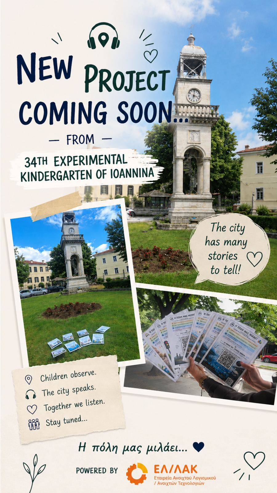
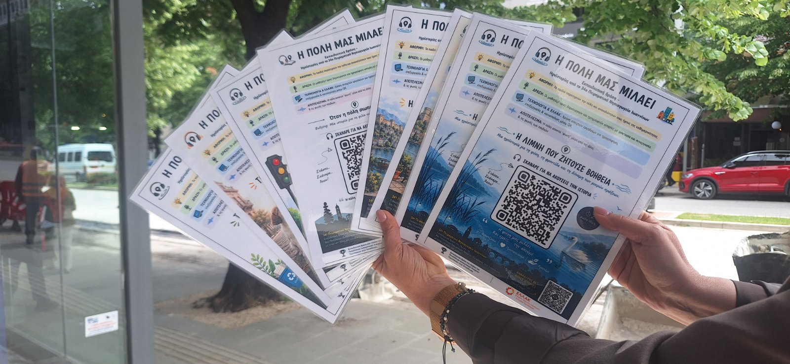
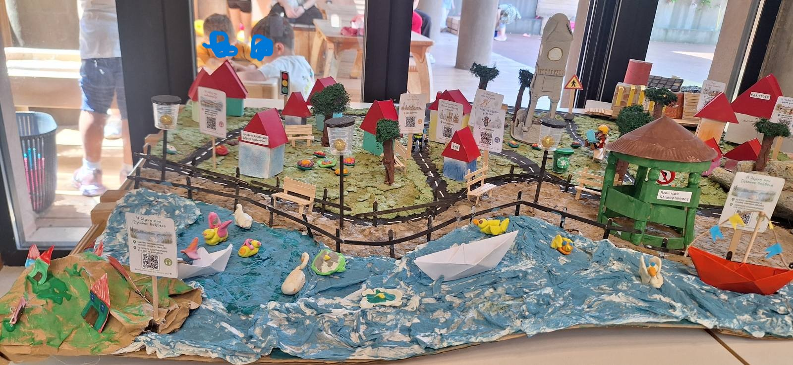
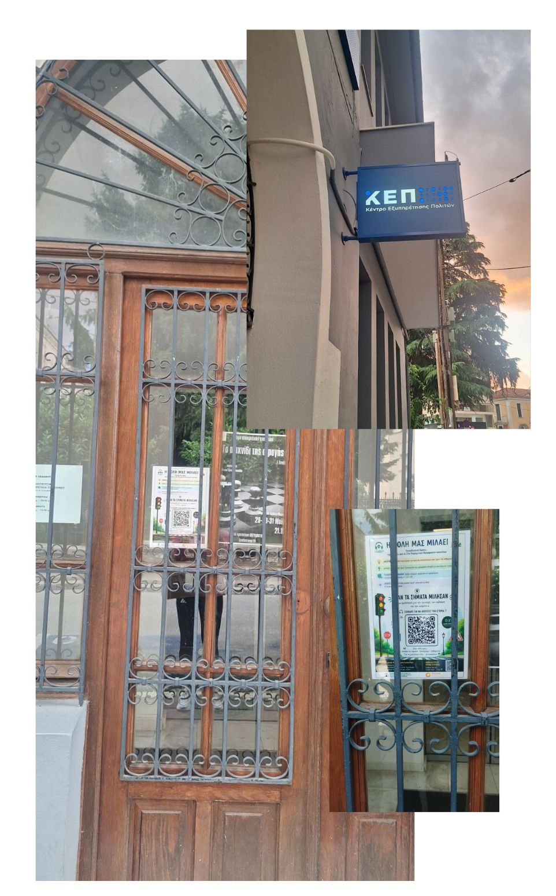
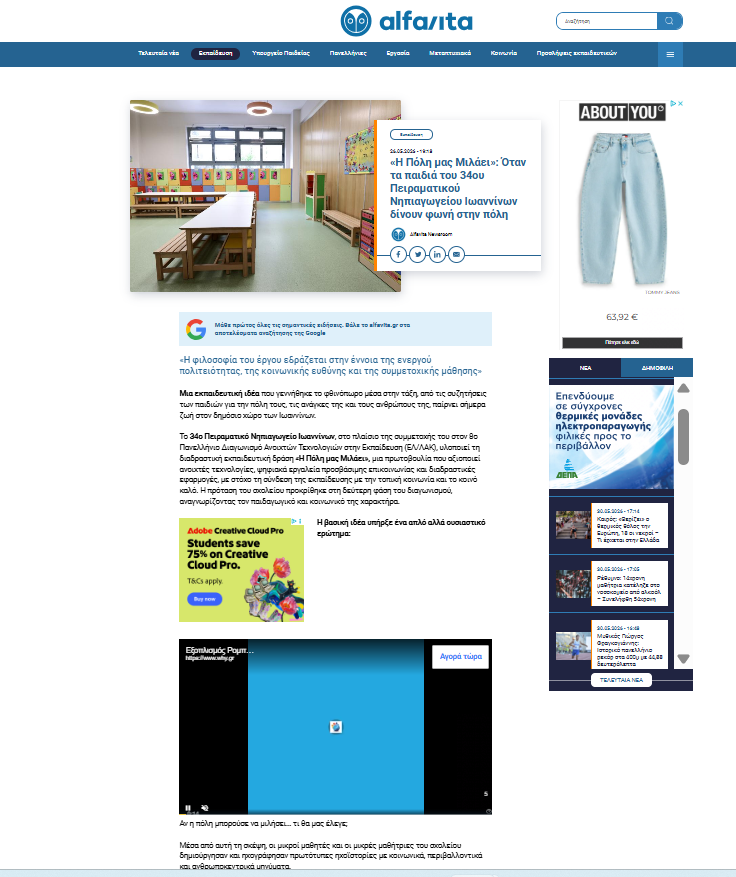
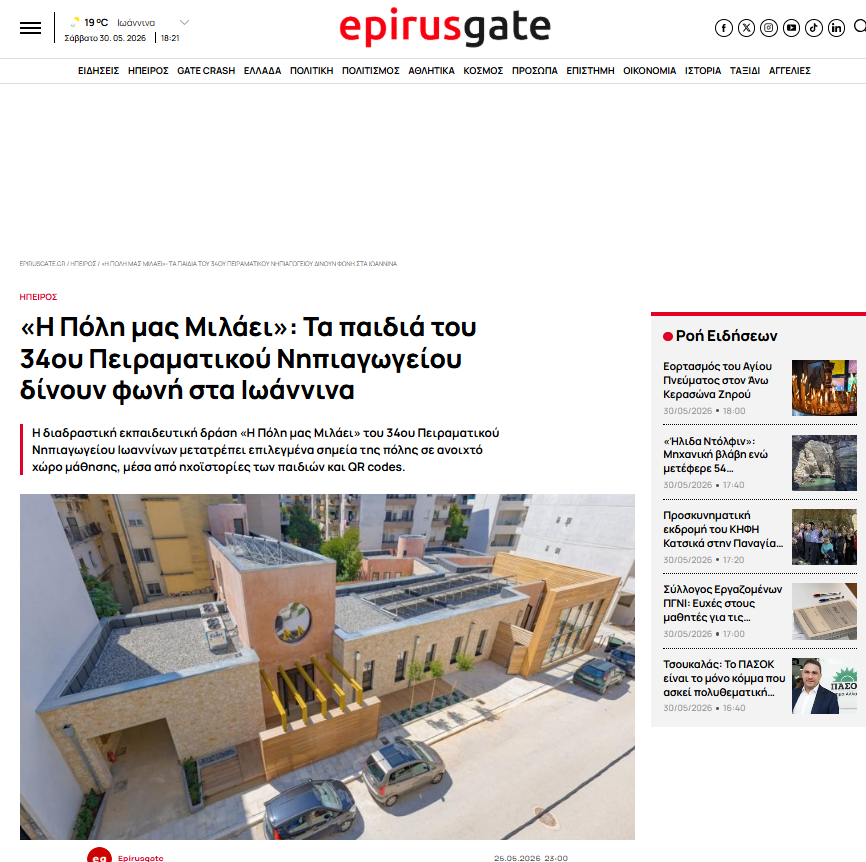
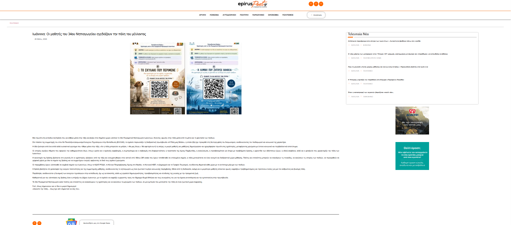
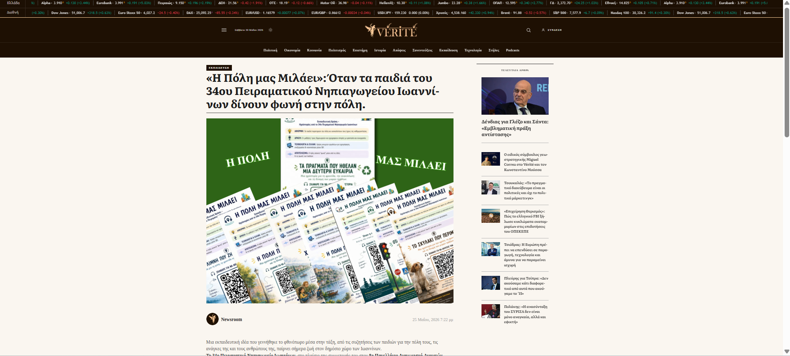

# Η ΠΟΛΗ ΜΑΣ ΜΙΛΑΕΙ

## Ηχο-Ιστορίες της Πόλης μας για Όλους

  

# Η ΠΟΛΗ ΜΑΣ ΜΙΛΑΕΙ  

### 34ο Πειραματικό Νηπιαγωγείο Ιωαννίνων

---

## Περιγραφή έργου

Το έργο **«Η Πόλη μας Μιλάει»** είναι μια συνεργατική εκπαιδευτική δράση προσχολικής εκπαίδευσης που συνδέει τη δημιουργική αφήγηση, την κοινότητα και τις ανοιχτές τεχνολογίες.

Τα παιδιά παρατηρούν την πόλη των Ιωαννίνων, συζητούν για τη ζωή στην κοινότητα και δημιουργούν σύντομα ηχο-παραμύθια με θέματα όπως:

- η συμπερίληψη
- η καλοσύνη
- ο σεβασμός
- η αποδοχή της διαφορετικότητας
- η προστασία του περιβάλλοντος
- η φροντίδα της πόλης

Οι ιστορίες ηχογραφούνται με χρήση ελεύθερου λογισμικού και συνδέονται με QR codes, ώστε κάθε πολίτης να μπορεί να τις ακούσει μέσα από έναν ανοιχτό “ηχητικό χάρτη” της πόλης.

---

# Ψηφιακή Πλατφόρμα Έργου

Για την υποστήριξη και διάχυση του έργου δημιουργήθηκε ειδική ψηφιακή πλατφόρμα:

https://sites.google.com/view/i-poli-mas-milaei

Η πλατφόρμα λειτουργεί ως κεντρικό σημείο πρόσβασης για μαθητές, γονείς και πολίτες και περιλαμβάνει:

* παρουσίαση του έργου
* οδηγίες χρήσης των QR Codes
* διαδραστικό χάρτη Google Maps με τα σημεία τοποθέτησης των ιστοριών
* πληροφορίες για τη δράση στην πόλη
* χώρο αλληλεπίδρασης μέσω Padlet

Μέσω του Padlet οι επισκέπτες μπορούν να μοιράζονται φωτογραφίες και εμπειρίες από την αναζήτηση και ακρόαση των ηχοϊστοριών, συμβάλλοντας στη δημιουργία μιας συμμετοχικής κοινότητας γύρω από το έργο.

# Στόχοι του έργου

Το έργο στοχεύει:

- στην ανάπτυξη προφορικού λόγου και αφηγηματικής ικανότητας
- στην καλλιέργεια συνεργασίας και ενσυναίσθησης
- στην ενίσχυση της ενεργού πολιτειότητας από την προσχολική ηλικία
- στην εξοικείωση με ανοιχτές τεχνολογίες
- στη δημιουργία προσβάσιμου ψηφιακού περιεχομένου για όλους

---

# Ανοιχτές Τεχνολογίες & Ελεύθερο Λογισμικό

Για την υλοποίηση του έργου αξιοποιήθηκαν:

- Audacity
- GitHub
- QR Code Generator
- Google Sites
- MP3 Audio Format
---

# Ηχοϊστορίες

## Η πόλη που καλωσορίζει
Μια ιστορία για την αποδοχή, τη φιλοξενία και τη δύναμη της ανθρώπινης παρουσίας.

## Η πόλη που είχε χώρο για όλους
Μια ιστορία για τη συμπερίληψη και τη διαφορετικότητα.

## Η λίμνη που ζητούσε βοήθεια
Μια ιστορία για το περιβάλλον και τη φροντίδα της πόλης.

## Όταν η πόλη σιωπαίνει
Μια ιστορία για τη φιλία, τον σεβασμό και τη δύναμη των λέξεων.

## Η Πόλη που άκουγε
Μια ιστορία για την ακοή, την ενσυναίσθηση και τη δύναμη της φροντίδας.

## Τα πράγματα που ήθελαν μια δεύτερη ευκαιρία
Μια ιστορία για τη φροντίδα, την ανακύκλωση και τη δύναμη των μικρών καλών πράξεων.

## Το σκυλάκι που περίμενε
Μια ιστορία για την αγάπη, τη φροντίδα και τη δύναμη των μικρών πράξεων.

## Όταν τα σήματα μίλησαν
Μια ιστορία για την προσοσχή, το σεβασμό και την ασφάλεια.

---

# Μεθοδολογία

Το έργο υλοποιήθηκε μέσα από:

1. Παρατήρηση και διερεύνηση της πόλης  
2. Συλλογική δημιουργία ιστοριών  
3. Ηχογράφηση και επεξεργασία ήχου  
4. Δημιουργία αφισών και QR codes  
5. Διάχυση στην κοινότητα

---

# Υλοποίηση του Έργου (Implementation)

## Φάση 1 – Γνωρίζουμε την πόλη μας

Τα παιδιά παρατήρησαν φωτογραφίες και σημεία του κέντρου των Ιωαννίνων και συζήτησαν για τους χώρους που χρησιμοποιούν καθημερινά οι πολίτες.

Κατά τη διάρκεια περιπάτων και δραστηριοτήτων παρατήρησης εντόπισαν σημεία με ιδιαίτερη σημασία για την κοινότητα, όπως η λίμνη Παμβώτιδα, το Δημαρχείο, τα ΚΕΠ και το Γραφείο Τουρισμού.

## Φάση 2 – Δημιουργούμε ιστορίες

Οι μαθητές εργάστηκαν συνεργατικά και δημιούργησαν πρωτότυπες ιστορίες με θέματα:

* τη συμπερίληψη
* την προστασία του περιβάλλοντος
* την ανακύκλωση
* τη φροντίδα των ζώων
* τον σεβασμό στη διαφορετικότητα
* την ενεργό συμμετοχή στην κοινότητα

Οι εκπαιδευτικοί κατέγραφαν τις ιδέες των παιδιών διατηρώντας τον αυθεντικό λόγο τους.

## Φάση 3 – Ηχογράφηση

Οι ιστορίες ηχογραφήθηκαν από τα παιδιά και μετατράπηκαν σε αρχεία ήχου.

Για την επεξεργασία χρησιμοποιήθηκε το λογισμικό Audacity.

Πραγματοποιήθηκαν δοκιμές έντασης, καθαρισμού θορύβου και τελικής εξαγωγής των αρχείων σε μορφή mp3.

## Φάση 4 – Δημιουργία QR Codes

Για κάθε ηχοϊστορία δημιουργήθηκε ξεχωριστός QR κώδικας.

Οι κώδικες συνδέθηκαν με τα ηχητικά αρχεία ώστε να είναι άμεσα προσβάσιμα από κινητές συσκευές.

## Φάση 5 – Διάχυση στην πόλη

Σε συνεργασία με τον Δήμο Ιωαννιτών επιλέχθηκαν δημόσιοι χώροι όπου τοποθετήθηκαν οι ηχοϊστορίες.

Οι πολίτες μπορούν να σαρώσουν τα QR codes και να ακούσουν τις ιστορίες των παιδιών στα πραγματικά σημεία της πόλης.

## Φάση 6 – Παρουσίαση και Διάχυση

Το έργο παρουσιάστηκε:

* στη σχολική κοινότητα
* σε γονείς και κηδεμόνες
* σε εκπαιδευτικούς
* σε τοπικά μέσα ενημέρωσης
* σε διαδικτυακές εκπαιδευτικές κοινότητες

Παράλληλα δημιουργήθηκε φυσική μακέτα του έργου και ψηφιακή ιστοσελίδα τεκμηρίωσης.
---

# Σύνδεση με το Αναλυτικό Πρόγραμμα

Το έργο συνδέεται με:

- Γλώσσα & Επικοινωνία
- STEM στην προσχολική εκπαίδευση
- Κοινωνική και συναισθηματική ανάπτυξη
- Ψηφιακό γραμματισμό
- Δημιουργική έκφραση

---

# Διάχυση στην κοινότητα

Οι αφίσες και οι ηχοϊστορίες παρουσιάστηκαν σε σημεία της πόλης των Ιωαννίνων και διαμοιράστηκαν μέσω QR codes, ώστε οι πολίτες να μπορούν να ακούσουν τις ιστορίες των παιδιών.

Το έργο επιδιώκει να μετατρέψει την πόλη σε έναν ανοιχτό χώρο αφήγησης, συμμετοχής και συμπερίληψης.

---

# Μακέτα Έργου

Στο πλαίσιο της διάχυσης και παρουσίασης του έργου δημιουργήθηκε φυσική μακέτα, στην οποία αποτυπώνονται τα σημεία της πόλης όπου τοποθετήθηκαν οι ηχοϊστορίες.

Η μακέτα χρησιμοποιήθηκε για την παρουσίαση του έργου σε γονείς, επισκέπτες και εκπαιδευτικούς.

Φωτογραφίες βρίσκονται στον φάκελο:

model/

# Ψηφιακή Καινοτομία

Το έργο συνδύασε φυσικό και ψηφιακό περιβάλλον μάθησης.

Οι ηχοϊστορίες τοποθετήθηκαν σε πραγματικά σημεία της πόλης μέσω QR codes, ενώ παράλληλα αναπτύχθηκε ψηφιακή πλατφόρμα που επιτρέπει:

* την εξερεύνηση των σημείων μέσω Google Maps
* την ακρόαση των ιστοριών εξ αποστάσεως
* τη συμμετοχή των πολιτών μέσω Padlet
* τη διαρκή επέκταση του έργου με νέο περιεχόμενο

Με αυτόν τον τρόπο δημιουργήθηκε ένα ανοιχτό και διαδραστικό οικοσύστημα μάθησης που συνδέει το σχολείο με την πόλη και την τοπική κοινότητα.

# Κοινωνικός Αντίκτυπος

Το έργο ξεπέρασε τα όρια της σχολικής τάξης.

Οι ηχοϊστορίες τοποθετήθηκαν σε πραγματικά σημεία της πόλης των Ιωαννίνων μέσω QR codes, δίνοντας τη δυνατότητα σε κατοίκους και επισκέπτες να ακούσουν τις αφηγήσεις των παιδιών.

Η δράση πραγματοποιήθηκε σε συνεργασία με τον Δήμο Ιωαννιτών και τοπικούς φορείς.

Τα παιδιά ανέλαβαν ενεργό ρόλο δημιουργών περιεχομένου για την κοινότητα, μετατρέποντας την πόλη σε έναν ανοιχτό χώρο αφήγησης και συμπερίληψης.

# Σημεία Τοποθέτησης στην Πόλη

| Ιστορία | Σημείο |
|----------|----------|
| Όταν η πόλη σωπαίνει | ΚΔΑΠ ΡΟΔΑ |
| Η πόλη που είχε χώρο για όλους | ΚΔΑΠ ΡΟΔΑ |
| Η λίμνη που ζητούσε βοήθεια | ΟΦΥΠΕΚΑ Νησάκι |
| Η λίμνη που ζητούσε βοήθεια | Περίπτερο Πληροφόρησης Καραβακίων |
| Τα πράγματα που ήθελαν μια δεύτερη ευκαιρία | ΚΕΠ Ιωαννίνων |
| Η πόλη που άκουγε | ΚΕΠ Ιωαννίνων |
| Όταν τα σήματα μίλησαν | ΚΕΠ Ιωαννίνων |
| Το σκυλάκι που περίμενε | Δημαρχείο Ιωαννίνων |
| Η πόλη που καλωσορίζει | Γραφείο Τουρισμού Δήμου Ιωαννιτών |

# Φωτογραφίες έργου

## Οι αφίσες της δράσης στο κέντρο της πόλης

---

## Η μακέτα του έργου

---

## Διάχυση στη σχολική κοινότητα

---

## Τοποθέτηση QR Codes

---

# Περιεχόμενα Αποθετηρίου

audio/ → Ηχοϊστορίες

qr_codes/ → QR Codes των ιστοριών

posters/ → Αφίσες έργου

photos/ → Φωτογραφικό υλικό

model/ → Μακέτα έργου

dissemination/ → Δράσεις διάχυσης

docs/ → Τεκμηρίωση

# Αποτελέσματα και Αντίκτυπος

Με την ολοκλήρωση του έργου επιτεύχθηκαν σημαντικά παιδαγωγικά, κοινωνικά και τεχνολογικά αποτελέσματα.

## Για τα παιδιά

* Δημιούργησαν πρωτότυπες ιστορίες με κοινωνικό περιεχόμενο.
* Ανέπτυξαν δεξιότητες προφορικού λόγου και αφήγησης.
* Συνεργάστηκαν σε όλα τα στάδια του έργου.
* Γνώρισαν βασικές έννοιες ψηφιακής δημιουργίας και διάχυσης περιεχομένου.
* Αντιλήφθηκαν ότι η τεχνολογία μπορεί να χρησιμοποιηθεί για κοινωνικό όφελος.

## Για τη σχολική κοινότητα

* Οι γονείς συμμετείχαν ενεργά στις δράσεις διάχυσης.
* Η μακέτα και οι παρουσιάσεις αποτέλεσαν αφορμή για συζήτηση γύρω από την προσβασιμότητα και τη συμπερίληψη.
* Δημιουργήθηκε εκπαιδευτικό υλικό που μπορεί να αξιοποιηθεί και τα επόμενα χρόνια.

## Για την τοπική κοινωνία

* Οι ηχοϊστορίες τοποθετήθηκαν σε πραγματικά σημεία της πόλης μέσω QR codes.
* Πολίτες και επισκέπτες είχαν τη δυνατότητα να ακούσουν τις ιστορίες των παιδιών.
* Αναπτύχθηκε ψηφιακός χάρτης με τα σημεία της δράσης.
* Δημιουργήθηκε ανοιχτό ψηφιακό αποτύπωμα του έργου μέσω της ιστοσελίδας και του GitHub.

## Βιωσιμότητα

Το έργο μπορεί να επεκταθεί εύκολα με νέες ιστορίες, νέα σημεία ενδιαφέροντος και συμμετοχή περισσότερων σχολείων, δημιουργώντας έναν διαρκώς ανανεούμενο ηχητικό χάρτη της πόλης.

# Δημοσιότητα και Αναγνώριση

Το έργο «Η Πόλη μας Μιλάει» παρουσιάστηκε και διαδόθηκε μέσω εκπαιδευτικών και ενημερωτικών ιστοσελίδων, συμβάλλοντας στη διάχυση καλών πρακτικών προσχολικής εκπαίδευσης, ανοιχτών τεχνολογιών και κοινωνικής καινοτομίας.

## Ενδεικτικά δημοσιεύματα

Το σχετικό υλικό βρίσκεται στον φάκελο:

press/

# Εκπαιδευτική ομάδα

34ο Πειραματικό Νηπιαγωγείο Ιωαννίνων

---

# Άδεια χρήσης

Το έργο διατίθεται με άδεια:

Creative Commons Attribution-NonCommercial-ShareAlike 4.0 International (CC BY-NC-SA 4.0)

---

# Η Πόλη μας Μιλάει

Μικρές φωνές.  
Μικρές ιστορίες.  
Μια πόλη πιο ανοιχτή για όλους.
